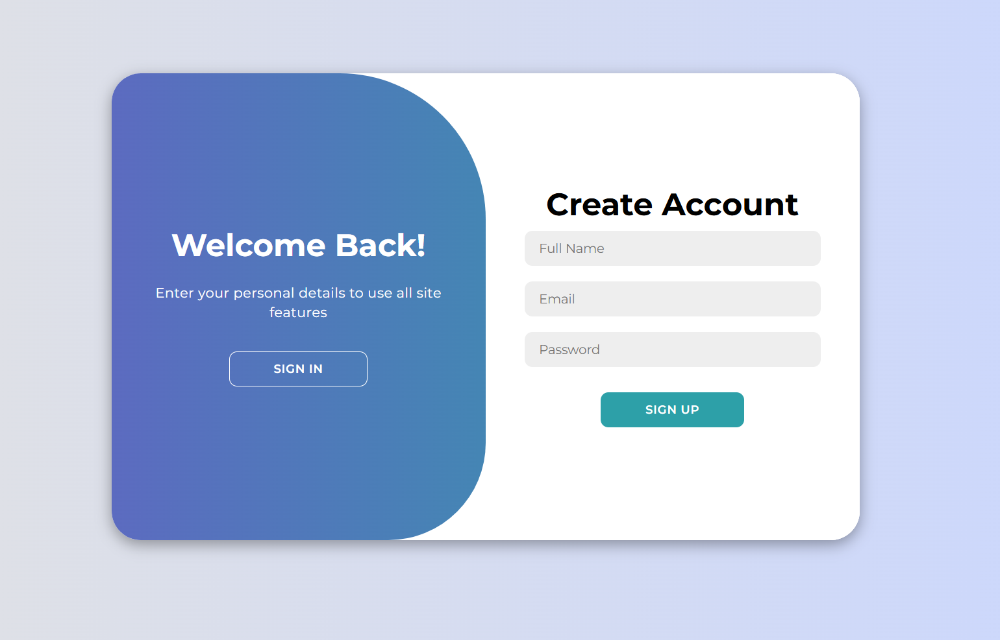
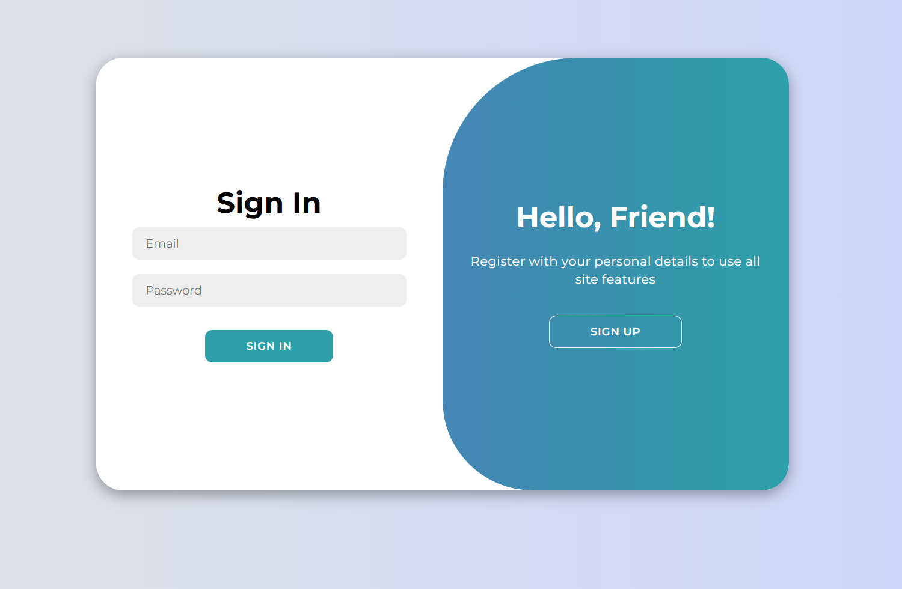
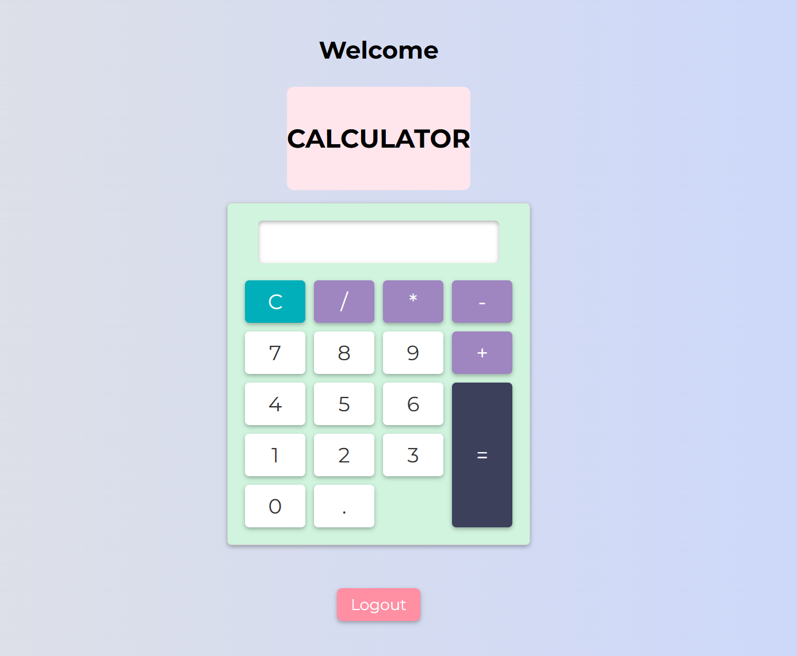

# 🔐 MERN Authentication System

A secure **User Authentication System** built using **Node.js, Express.js, MongoDB, and JWT**.
This project implements **Signup, Login, Password Hashing, and JWT-based Protected Routes**.

It demonstrates how modern web applications securely manage user authentication.

---

## 🚀 Features

✔ User Registration (Signup)
✔ Secure Login Authentication
✔ Password Hashing using **bcrypt**
✔ JWT (JSON Web Token) Authentication
✔ Protected Routes with Middleware
✔ MongoDB Database Integration
✔ Dashboard Access Only After Login
✔ Logout Functionality

---

## 🛠 Tech Stack

| Technology  | Purpose               |
| ----------- | --------------------- |
| Node.js     | Backend runtime       |
| Express.js  | Server framework      |
| MongoDB     | Database              |
| Mongoose    | MongoDB ODM           |
| JWT         | Secure authentication |
| bcrypt      | Password hashing      |
| HTML/CSS/JS | Frontend UI           |

---

## 📂 Project Structure

```
Basic-authentication-system
│
├── middleware
│   └── verifyToken.js
│
├── models
│   └── User.js
│
├── routes
│   └── auth.js
│
├── static
│   ├── index.html
│   ├── dashboard.html
│   ├── script.js
│   └── style.css
│
├── server.js
├── package.json
├── .gitignore
└── README.md
```

---

## 🔑 Authentication Flow

1️⃣ User registers with name, email, and password
2️⃣ Password is hashed using **bcrypt**
3️⃣ User logs in with credentials
4️⃣ Server generates a **JWT token**
5️⃣ Token is stored in **localStorage**
6️⃣ Protected routes verify the JWT before granting access

---

## ⚙️ Installation & Setup

Clone the repository

```
git clone https://github.com/yourusername/Basic-authentication-system.git
```

Navigate to the project folder

```
cd basic-authentication-system
```

Install dependencies

```
npm install
```

Create a `.env` file and add:

```
MONGO_URI=your_mongodb_connection_string
JWT_SECRET=your_secret_key
PORT=4000
```

Start the server

```
node server.js
```

Open in browser

```
http://localhost:4000
```

---

## 📸 Screenshots

### Sign Up Page


### Sign In Page


### Dashboard


## 🔒 Security Features

* Passwords stored securely using **bcrypt hashing**
* Authentication managed using **JWT tokens**
* Protected routes implemented with **custom middleware**
* Environment variables used for sensitive credentials

---

## 🎯 Learning Outcomes

This project demonstrates practical understanding of:

* Backend authentication systems
* JWT token handling
* Secure password storage
* REST API development
* MongoDB database integration

---

## 👨‍💻 Author

**Rimzhim**

Computer Science Graduate
Aspiring **Full Stack Developer**

---

## ⭐ If you like this project

Give it a ⭐ on GitHub!
